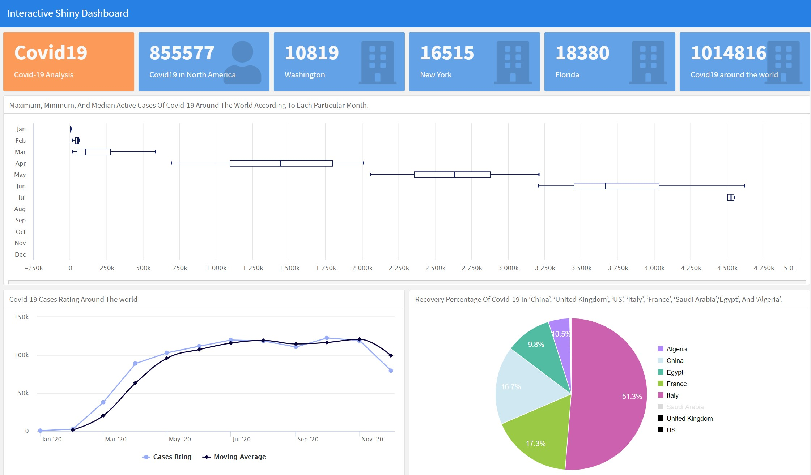

# SDA_And_Coding-Dojo-Shiny-Dashboard

## Introduction:

In this project, we will apply what we've learned on valuable Shiny Dashboard lessons with **R**. We built an interactive dashboard to convey our message in a professional method and attract the audience's attention. We used Covid19 data of North America and all countries all over the world to discover the percentage of Recovery, Deaths, Confirmed cases.

Let's discover more on [ShinnyApps](https://sdashinyapp.shinyapps.io/shiny_dashboard/)

## Project Tools And Libraries:
- ``R``

- [billboarder](https://cran.r-project.org/web/packages/billboarder/billboarder.pdf)

- [lubridate](https://lubridate.tidyverse.org/)
- [shiny](https://shiny.rstudio.com/)
- [rsconnect](https://cran.r-project.org/web/packages/rsconnect/rsconnect.pdf)
- [tidyverse](https://www.tidyverse.org/packages/)
- [dplyr](https://cran.r-project.org/web/packages/dplyr/vignettes/dplyr.html)
- [flexdashboard](https://rmarkdown.rstudio.com/flexdashboard/)
- [knitr](https://www.rdocumentation.org/packages/knitr/versions/1.30)

## Results:

## Resources:
- [Kaagle](https://www.kaggle.com/okwirjulius/covid19-cases-in-africa)
- [byollin shinyapps](https://byollin.shinyapps.io/VisionZero/)
- [ShinyApps](https://www.shinyapps.io/)

